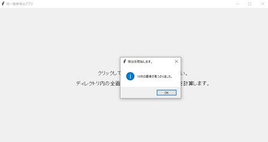
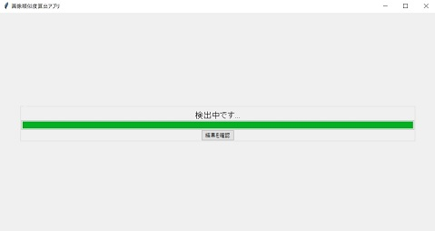
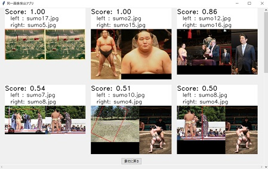

# 同一画像検出アプリ
ディレクトリ内の画像に対して、同じ画像らしさを検出するアプリです。   
一部が切り取られていたり回転したりしていても、判定することが可能です。

# 前提条件
- Python 3.7.0 +

# インストール
- このレポジトリをクローンします。
- `python -m pip install -r requirements.txt`を実行します。

# 使い方
1. アプリを起動します。
    ```
    python src/app.py
    ```

1. 画面をクリックして、検出したい画像が含まれているディレクトリを選びます。  
    画像枚数の確認が出ます。  
    

1. 確認後、検出が開始されます。  
    

1. 検出終了後、`結果を確認`ボタンを押すと結果が表示されます。  
    （上位15件が表示されるようになっています。）  
    

1. `最初に戻る`ボタンを押すと、ディレクトリ選択画面に戻ります。

# 注意事項
- 画像の読み込みに`cv2.imread(path)`を使用しているため、  
    pathにASCII文字以外が含まれていると読み込めません。  
    そのため、ASCII文字以外が名前に含まれている画像は除外しています。

- 全画像に対して総当たりでスコアを求めるため、  
    n枚の画像に対してnC2回（1回およそ0.3秒）処理が実行されます。  
    そのため、画像の枚数が増えると一気に所要時間が増えてしまいます。    
    | 枚数 | 処理回数 | 所要時間 |
    | --- | --- | --- |
    | 10枚 | 45回 | 13.5秒 |
    | 100枚 | 4,950回 | 24分45秒 |
    | 200枚 | 19,900回 | 1時間39分30秒 |

# TODO
- 検出結果をCSVで出力できるようにする。
- READMEの画像を変える。
- CSV, Excel出力の際に、ディレクトリとファイル名を指定するようにする。
- 縮尺が小さすぎる、大きすぎる場合を省くように修正する。