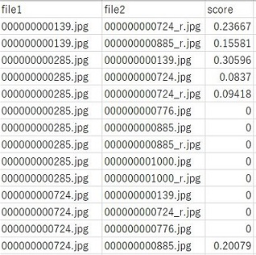
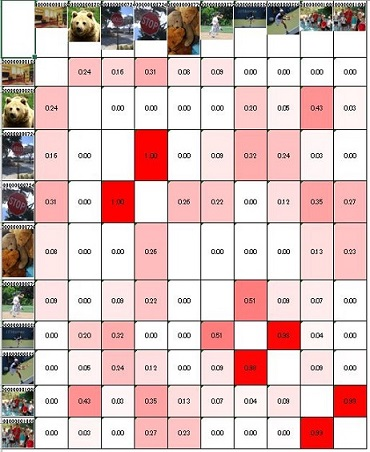

# 画像類似度算出アプリ
選択した画像の類似度を求めて表示するアプリです。  
拡大・縮小、回転、一部切り取りにも対応できるように作成しました。

## 必要条件
- Python >= 3.8

## インストール
```
git clone https://github.com/yuichi0625/image-similarity-calculator.git
```

必要なライブラリをインストールします。
```
cd image-similarity-calculator
python -m pip install -r requirements.txt
```

## 使い方
1. アプリを起動します。
    ```
    python src/main.py
    ```

1. 画面をクリックして、画像を選びます。  
    枚数の確認が出るので、`OK`を押します。

    

1. 確認後、検出が開始されます。  
    検出終了後、`結果を確認`を押します。

    

1. 結果が表示されます。  
    デフォルトでは類似度上位15件が表示されるようになっています。
    - Scoreは類似度
    - leftは左の画像のファイル名
    - rightは右の画像のファイル名

    

1. `CSVに出力`を押すと、以下のようなCSVファイルが出力されます。  
    内容は、file1とfile2のscore(=類似度)をファイル名順に並べています。

    

1. `Excelに出力`を押すと、以下のようなExcelファイルが出力されます。  
    内容は、画像の類似度を格子状に出力し、類似度の大小に応じてセルに濃淡をつけています。

    

1. `最初に戻る`ボタンを押すと、最初の画面に戻ります。

## 注意事項
- 画像の読み込みに`cv2.imread(画像のパス)`を使用しているため、pathにASCII文字以外が含まれていると読み込めません。そのため、ASCII文字以外が名前に含まれている画像は除外しています。

- 全画像に対して総当たりでスコアを求めるため、計算量は`O(n^2)`となっています。

## TODO
- Excel出力部分をopenpyxlのWorkbook(write_only=True)で書き換える。
    - 現在のWorkbook()だと、画像枚数が増えたとき出力に恐ろしいくらい時間がかかってしまう。
