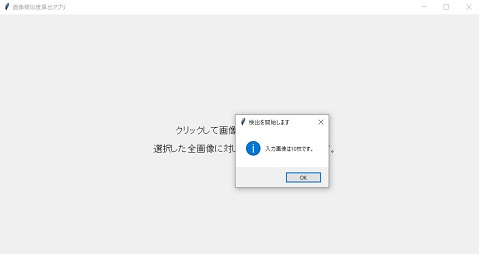
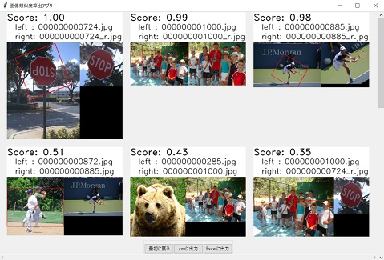

# 同一画像検出アプリ
- 仕事で、切り取り・回転に対応した同一画像検出を行ったので、残したかった
- GUIを作ってみたかった

というモチベーションで作成したアプリです。  
ディレクトリを指定すると、ディレクトリ内の画像の類似度を表示します。

## 必要条件
- Python >= 3.7

## インストール
```
git clone https://github.com/yuichi0625/identical-image-detector.git
```

必要なライブラリをインストールします。
```
cd identical-image-detector
python -m pip install -r requirements.txt
```

## 使い方
1. アプリを起動します。
    ```
    python src/app.py
    ```

1. 画面をクリックして、検出したい画像が含まれているディレクトリを選びます。  
    画像枚数の確認が出ます。  
    

1. 確認後、検出が開始されます。  
    

1. 検出終了後、`結果を確認`ボタンを押すと結果が表示されます。  
    （上位15件が表示されるようになっています。）  
    

1. `最初に戻る`ボタンを押すと、ディレクトリ選択画面に戻ります。

## 注意事項
- 画像の読み込みに`cv2.imread(path)`を使用しているため、  
    pathにASCII文字以外が含まれていると読み込めません。  
    そのため、ASCII文字以外が名前に含まれている画像は除外しています。

- 全画像に対して総当たりでスコアを求めるため、  
    n枚の画像に対してnC2回（1回およそ0.3秒）処理が実行されます。  
    そのため、画像の枚数が増えると一気に所要時間が増えてしまいます。    
    | 枚数 | 処理回数 | 所要時間 |
    | --- | --- | --- |
    | 10枚 | 45回 | 13.5秒 |
    | 100枚 | 4,950回 | 24分45秒 |
    | 200枚 | 19,900回 | 1時間39分30秒 |

## TODO
- CSV, Excel出力の際に、ディレクトリとファイル名を指定するようにする。